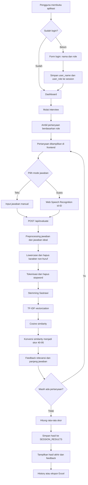

# JobifyAI

JobifyAI adalah aplikasi web simulasi wawancara kerja berbasis Flask. Pengguna memilih role pekerjaan, menjawab pertanyaan interview melalui teks atau suara, lalu mendapatkan skor relevansi dan feedback otomatis untuk jawaban berbahasa Indonesia.

## Fitur Utama

- Login sederhana menggunakan nama dan role pekerjaan.
- Bank pertanyaan khusus untuk tujuh role:
  - Data Scientist
  - Data Engineer
  - Web Developer
  - Backend Developer
  - Frontend Developer
  - Machine Learning Engineer
  - Mobile Developer
- Dua mode jawaban: teks dan voice input melalui Web Speech API.
- Penilaian otomatis dengan preprocessing Bahasa Indonesia, TF-IDF, dan cosine similarity.
- Feedback per pertanyaan berdasarkan relevansi dan panjang jawaban.
- Ringkasan nilai rata-rata dan feedback keseluruhan setelah semua pertanyaan selesai.
- Riwayat sesi interview dengan pagination.
- Ekspor riwayat ke file Excel (`.xlsx`).

## Pipeline Aplikasi



## Alur Penilaian

1. Jawaban pengguna dan jawaban ideal untuk pertanyaan terkait diproses dengan fungsi `preprocess()`.
2. Preprocessing meliputi lowercase, penghapusan karakter non-huruf, tokenisasi, stopword removal, dan stemming Sastrawi.
3. Teks hasil preprocessing diubah menjadi vektor TF-IDF.
4. Cosine similarity dihitung antara jawaban pengguna dan seluruh jawaban ideal.
5. Nilai similarity tertinggi dipetakan secara linear menjadi skor integer dengan rentang 40-95.
6. Sistem menambahkan feedback berdasarkan skor dan jumlah kata jawaban.

## Teknologi

- Python 3
- Flask 3.0
- scikit-learn dan NumPy untuk TF-IDF serta cosine similarity
- Sastrawi untuk stemming Bahasa Indonesia
- Pandas dan openpyxl untuk ekspor Excel
- Jinja2, HTML, CSS, dan JavaScript
- Web Speech API untuk input jawaban melalui suara

## Persyaratan

- Python 3.10 atau versi yang lebih baru
- Browser yang mendukung Web Speech Recognition jika ingin memakai mode suara
- Akses mikrofon untuk fitur voice input

## Instalasi dan Menjalankan Aplikasi

Jalankan perintah berikut dari direktori proyek:

```powershell
python -m venv .venv
.\.venv\Scripts\Activate.ps1
python -m pip install -r requirements.txt
python app.py
```

Buka alamat berikut di browser:

```text
http://localhost:7070
```

Untuk menjalankan Flask dengan mode debug, gunakan:

```powershell
flask --app app run --debug --port 7070
```

## Endpoint Utama

| Method | Endpoint | Keterangan |
|---|---|---|
| `GET`, `POST` | `/login` | Menampilkan dan memproses login |
| `GET` | `/logout` | Menghapus session pengguna |
| `GET` | `/` | Dashboard statistik interview |
| `GET` | `/interview` | Memulai sesi interview berdasarkan role |
| `POST` | `/api/evaluate` | Mengevaluasi jawaban dan mengirim pertanyaan berikutnya |
| `GET` | `/history` | Menampilkan riwayat interview dengan pagination |
| `GET` | `/history/export` | Mengunduh riwayat dalam format Excel |

Contoh payload untuk endpoint evaluasi:

```json
{
  "answer": "Saya menggunakan Python dan pandas untuk membersihkan data.",
  "question_index": 0
}
```

## Struktur Proyek

```text
JobifyAI/
├── app.py                         # Route Flask, session, API, dashboard, history, export
├── answer_keys.py                 # Jawaban ideal untuk setiap pertanyaan
├── text_scoring.py                # Preprocessing, TF-IDF, similarity, dan scoring
├── requirements.txt               # Dependensi Python
├── questions/
│   ├── __init__.py                # Daftar role dan pemetaan bank pertanyaan
│   └── <role>.py                  # Pertanyaan berdasarkan role
├── templates/                     # Template halaman Jinja
│   ├── base.html
│   ├── login.html
│   ├── dashboard.html
│   ├── interview.html
│   └── history.html
└── static/
    ├── css/main.css               # Styling antarmuka
    └── js/interview.js             # Interaksi interview dan speech recognition
```

## Pengujian

Saat ini proyek belum memiliki test suite otomatis. Jika tests sudah ditambahkan ke folder `tests/`, jalankan:

```powershell
python -m unittest discover -s tests
```

Area yang sebaiknya diuji mencakup jawaban kosong, indeks pertanyaan tidak valid, pemilihan role, rentang skor, dan alur penyelesaian interview.

## Catatan Pengembangan dan Keamanan

- Hasil interview disimpan sementara di `SESSION_RESULTS` dalam memori, sehingga data hilang ketika server dimulai ulang.
- `SESSION_RESULTS` saat ini belum dipisahkan berdasarkan pengguna.
- Sebelum deployment, ganti placeholder `SECRET_KEY` di `app.py` dengan secret dari environment variable.
- Jangan commit secret, data pengguna, file hasil ekspor, atau folder virtual environment.
- Untuk production, gunakan database, server WSGI, konfigurasi Flask production, dan penyimpanan session yang sesuai.
